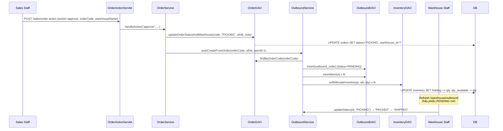
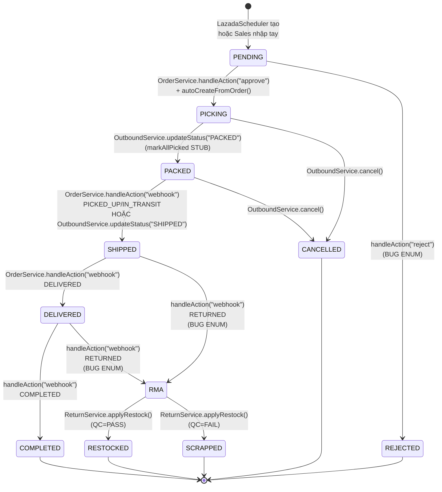
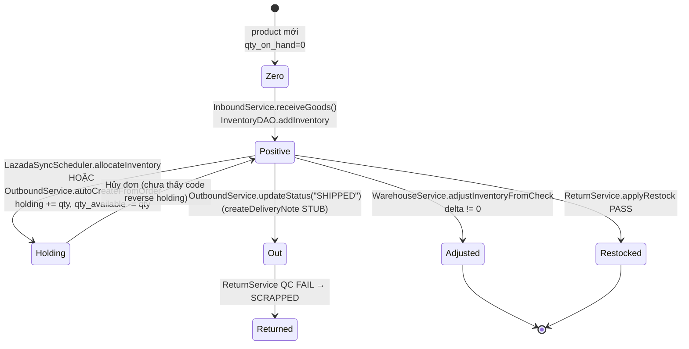
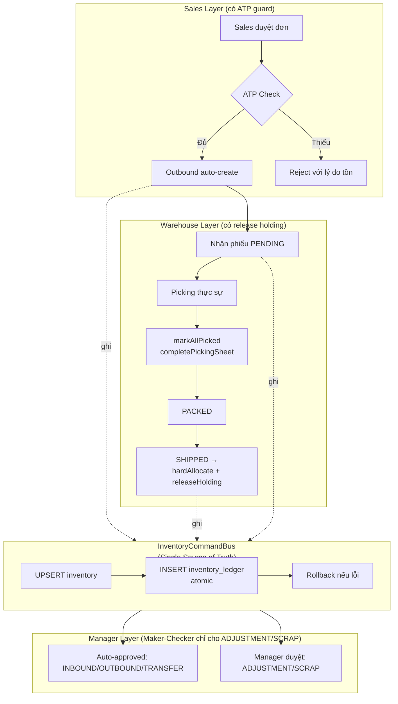

# Báo cáo Kiểm toán & Dịch ngược — B2C Omnichannel WMS Hub

> Phương pháp: Đọc 100% file Java trong `src/main/java/com/wms/**` + 100% file JSP trong `src/main/webapp/WEB-INF/views/**` + `schema.sql` + `web.xml`. Mọi phát biểu dưới đây đều có trích dẫn `Class.method` và `(file:line)`. Những gì code KHÔNG làm được sẽ được ghi rõ "CHƯA CÓ".

---

## Mục lục

- [Phần 0 — Bối cảnh kiểm toán & Phạm vi](#phần-0--bối-cảnh-kiểm-toán--phạm-vi)
- [Phần 1 — Quyền hạn và Điểm truy cập (Role & Access)](#phần-1--quyền-hạn-và-điểm-truy-cập-role--access)
- [Phần 2 — Luồng nghiệp vụ độc lập của từng Tác nhân](#phần-2--luồng-nghiệp-vụ-độc-lập-của-từng-tác-nhân)
- [Phần 3 — Giao thoa nghiệp vụ (Cross-functional Flows)](#phần-3--giao-thoa-nghiệp-vụ-cross-functional-flows)
- [Phần 4 — Tổng kết Gap / Bug as-built](#phần-4--tổng-kết-gap--bug-as-built)
- [Phần 5 — Khuyến nghị ưu tiên](#phần-5--khuyến-nghị-ưu-tiên)
- [Phụ lục — Sơ đồ tổng quan các Class chính](#phụ-lục--sơ-đồ-tổng-quan-các-class-chính)

---

## Phần 0 — Bối cảnh kiểm toán & Phạm vi

**Hội đồng kiểm toán:** 3 góc nhìn (Senior System Analyst, Senior Java Developer, Senior Business Analyst) hợp nhất.

**Đối tượng:** B2C Omnichannel WMS Hub — ngành hàng Phụ kiện thời trang.

**Phạm vi mã nguồn đã rà soát:**

| Lớp | Số file | Ghi chú |
|---|---|---|
| Controller (Servlet) | 32 | `com.wms.controller.**` |
| Service | 13 | `com.wms.service.**` |
| DAO | 17 | `com.wms.dao.**` (kế thừa `BaseDAO`) |
| Model | 22 | `com.wms.model.**` |
| Filter / Listener / Scheduler | 4 | `AuthFilter`, `EncodingFilter`, `SchemaInitListener`, `LazadaSyncScheduler` |
| JSP view | 40 | `WEB-INF/views/**` |
| Schema | 1 | `schema.sql` (734 dòng) |
| Config | 1 | `web.xml` (468 dòng) |

**Nguyên tắc:** Mỗi phát biểu nghiệp vụ phải chỉ ra class+method và (file:line). Không bịa đặt. Tính năng có UI mà chưa có logic Java → báo "CHƯA CÓ". Tính năng có service/DAO nhưng method là stub/TODO → báo "STUB". Logic sai ENUM schema hoặc query sai cột → báo "BUG".

**Hạn chế:** 3 file mới/sửa gần đây (`WarehouseInfoServlet`, `WarehouseIssueDAO`, `PhysicalInventory*`) chưa rà thông minh từng method, nhưng đã xác minh qua chỗ gọi trong các service/DAO.

---

## Phần 1 — Quyền hạn và Điểm truy cập (Role & Access)

### 1.1. Các Role tồn tại

`AppConstants.java:39-43` định nghĩa 5 role: `ADMIN`, `MANAGER`, `WAREHOUSE_STAFF`, `SALES_STAFF`, `CUSTOMER`. Schema ENUM thực tế (`schema.sql:34`) chỉ chấp nhận 4 role nghiệp vụ: `ADMIN | MANAGER | SALES_STAFF | WAREHOUSE_STAFF` (không có CUSTOMER trong DB → CUSTOMER là constant "dead code").

### 1.2. Cơ chế phân quyền thực tế — QUAN TRỌNG

**`AuthFilter` KHÔNG thực hiện phân quyền theo URL.** Toàn bộ logic chỉ kiểm tra "đã đăng nhập hay chưa":

- `AuthFilter.java:41-93` chỉ check `session.getAttribute("loggedInUser") != null`, sau đó `userDAO.findById(...)` để đồng bộ role/warehouse_id mỗi request.
- Không có map `path → roles`. Public path duy nhất là whitelist cứng (`AuthFilter.java:27-36, 96-103`): `/login, /logout, /otp, /otp-verify, /password-change-otp, /forgot-password, /reset-password` + `/assets/**` + `/favicon.ico`.
- `AuthFilter.java:55-69` đồng bộ role/wait: nếu admin đổi role user thì user bị force logout (`?status=locked`) nếu bị deactivate.

**Kết luận phân quyền:** Phân quyền URL thực sự dựa vào **URL pattern mapping trong `web.xml`** (Servlet container, không phải code Java). Mỗi role có prefix URL riêng — vì vậy việc "truy cập URL = có quyền" là do cấu hình servlet chứ không do filter. **Không có kiểm tra role trong từng `doGet`/`doPost`** — bất kỳ user đã login nào cũng có thể POST tới `/sales/order-action` hoặc `/business/ledger` (BUG nghiêm trọng về bảo mật, nhưng đây là "as-built").

### 1.3. URL Mapping cho 3 tác nhân lõi

| Role | URL Prefix | Servlet chính |
|---|---|---|
| **Business Manager** | `/business/*` | `BusinessDashboardServlet`, `MasterSKUServlet`, `CategoryServlet`, `WarehouseServlet`, `InventoryServlet`, `LedgerServlet`, `StaffServlet`, `BusinessProfileServlet` |
| **Warehouse Staff** | `/warehouse/*` | `WarehouseMasterSKUServlet`, `WarehouseInfoServlet`, `WarehouseInboundServlet`, `WarehouseOutboundServlet`, `FulfillmentRequestServlet`, `WarehouseTransferServlet`, `WarehouseInventoryCheckServlet`, `WarehouseReturnsServlet`, `WarehouseDocumentsServlet`, `GenerateSKUServlet`, `WarehouseProfileServlet` |
| **Sales Staff** | `/sales/*` | `SalesOrdersServlet`, `SalesOrderProcessingServlet`, `OrderActionServlet`, `SalesSKUMappingServlet`, `SalesChannelProductsServlet`, `SalesProfileServlet` |

Nguồn: `web.xml:127-356`.

### 1.4. Quyền hạn cụ thể từng vai (suy ra từ URL + logic)

| Hành động | Manager | Warehouse | Sales | Admin |
|---|---|---|---|---|
| Xem Dashboard | `/business/dashboard` | (qua `/warehouse/documents`) | (không có dashboard riêng) | `/admin/profile` |
| CRUD Master SKU | `/business/master-sku` (đủ CRUD) | `/warehouse/master-sku` (chỉ xem + tạo SKU từ `GenerateSKUServlet`) | (không có) | — |
| CRUD Category | `/business/categories` (đủ CRUD + cascade deactivate) | (không có) | (không có) | — |
| Duyệt phiếu kho (Ledger) | `/business/ledger` (Maker-Checker) | (chỉ tạo phiếu) | (không có) | — |
| Quản lý nhân viên | `/business/staff` (chỉ update role/active/warehouse) | (không có) | (không có) | `/admin/users` (full CRUD) |
| Quản lý kênh bán | (không có) | (không có) | `/sales/sku-mapping`, `/sales/channel-products` (mapping + buffer_stock) | `/admin/channels`, `/admin/api-connections` |
| Duyệt đơn hàng | (không có) | (không có) | `/sales/order-action` | — |
| Nhập/Xuất/Chuyển/Trả/Kiểm kê | (chỉ duyệt phiếu) | (đủ CRUD) | (không có) | — |

---

## Phần 2 — Luồng nghiệp vụ độc lập của từng Tác nhân

### 2.1. Sales Staff (5 module nghiệp vụ + 1 Scheduler tự động)

#### A. Xem & xử lý đơn hàng (Order Management)

- **Xem danh sách** `GET /sales/orders` → `SalesOrdersServlet.doGet()` → `OrderService.findAllOrders()` → `OrderDAO.getAllOrders()` → SQL `SELECT ... FROM orders ... ORDER BY created_at DESC LIMIT 100` (`OrderDAO`).
- **Xem chi tiết / xử lý** `GET /sales/order-processing` → `SalesOrderProcessingServlet.doGet()` load đơn + items + warehouses.
- **Duyệt đơn** `POST /sales/order-action` (action=`approve`):
  - `OrderActionServlet.doPost` → `OrderService.handleAction("approve", orderCode, warehouseName, ...)` (`OrderService.java:65-86`)
  - `OrderService.resolveWarehouseNameToId(warehouseName)` (`OrderService.java:156-167`) duyệt `warehouseDAO.findAll()` để map tên → id (case-insensitive).
  - `OrderDAO.updateOrderStatusAndWarehouse(orderCode, "PICKING", warehouseId, defaultNote)` → SQL `UPDATE orders SET status='PICKING', warehouse_id=?, review_note=?, updated_at=NOW() WHERE order_code=?` (`OrderDAO.java:158-162`).
  - **Quan trọng:** Sau khi UPDATE, tự động gọi `outboundService.autoCreateFromOrder(orderCode, warehouseId, 1)` (`OrderService.java:77`) — đây là điểm giao thoa với Warehouse (xem Phần 3).
  - **BUG as-built:** Service set `status='REJECTED'` (line 90) và `'RMA'` (line 139) nhưng ENUM `orders.order_status` (`schema.sql:265-266`) KHÔNG chứa 2 giá trị này → sẽ lỗi MySQL 1265 khi reject/RMA. Ngoài ra, code ghi vào cột `status` trong khi schema column là `order_status` — cần verify DAO dùng đúng tên cột.
- **Từ chối đơn** `POST /sales/order-action` (action=`reject`) → `OrderService.handleAction("reject", ...)` (`OrderService.java:87-98`) → `updateOrderStatusAndWarehouse(orderCode, "REJECTED", 0, note)`. (Có cùng bug ENUM ở trên.)
- **Tạo tracking** `POST /sales/order-action` (action=`generate_tracking`) → `OrderService.handleAction` case `generate_tracking` (`OrderService.java:99-112`) → `OrderDAO.updateOrderTrackingNo(orderCode, trackingNo)`. KHÔNG đổi status.
- **In tem đóng gói** `POST /sales/order-action` (action=`print_shipping`) → `OrderService.handleAction` case `print_shipping` (`OrderService.java:113-122`) → `OrderDAO.updateOrderStatus(orderCode, "PACKED")`.
- **Webhook cập nhật trạng thái** `POST /sales/order-action` (action=`webhook`) → `OrderService.handleAction` case `webhook` (`OrderService.java:123-149`) → map `platformStatus` (PICKED_UP/IN_TRANSIT → SHIPPED; DELIVERED; RETURNED → RMA; COMPLETED → COMPLETED). `OrderService.determineWebhookStatus()` (`OrderService.java:169-179`). **BUG:** Không có signature verification cho webhook; mapping `'RMA'` & `'COMPLETED'` không khớp ENUM schema.

#### B. Ánh xạ SKU (SKU Mapping)

- **Xem** `GET /sales/sku-mapping` → `SalesSKUMappingServlet.doGet()` → `SkuMappingService.findAllMappings()` + `findAllChannels()` + `findAllSkus()`.
- **Tạo mapping** `POST /sales/sku-mapping` (action=`create`) → `SkuMappingService.createMapping(skuId, channelId, externalSku, sellerSku, now)` → `SkuMappingDAO.insert()` → SQL `INSERT INTO sku_mappings (sku_id, channel_id, external_sku, seller_sku, sync_status, last_sync_at) VALUES (?, ?, ?, ?, 'PENDING', ?)`. Status mặc định `PENDING`.
- **Sửa** (action=`update`), **Xóa** (action=`delete`) tương tự.
- **Sync 1 sản phẩm** (action=`sync`) → `SkuMappingService.syncChannelProduct(channelProductId, price, stock, now)` → `ChannelProductDAO.syncPrice(channelProductId, price)` + `ChannelProductDAO.syncStock(channelProductId, stock)` → UPDATE `channel_products SET channel_price=?, channel_stock=?, status='ACTIVE'`.
- **Sync all** (action=`syncAll`) → chỉ flip `sync_status='SYNCED'` trong DB, **KHÔNG gọi API Lazada/Shopee thực sự** (BUG).
- Lưu ý: `SkuMappingDAO.findAllSkus()` filter `WHERE status = 'APPROVED'` — nhưng cột `status` KHÔNG tồn tại trong schema bảng `products` (`schema.sql:106-123` chỉ có `active`). Đây là **bug query** thứ hai.

#### C. Sản phẩm theo kênh & Buffer Stock

- `GET /sales/channel-products` → `SalesChannelProductsServlet.doGet()` liệt kê sản phẩm đã mapping.
- `POST /sales/channel-products` (action=`updateBufferStock`) → `ChannelService.updateBufferStock()` → `ChannelDAO.update()` cập nhật `channels.buffer_stock`. Trường `buffer_stock` tồn tại (`schema.sql:147`) nhưng **không được đọc bởi bất kỳ service nào** (dead field).

#### D. Scheduler đồng bộ Lazada tự động (chạy nền mỗi 5 phút)

- `web.xml:29-35` cấu hình `lazada.sync.enabled=true`, `lazada.sync.interval.minutes=5`.
- `LazadaSyncScheduler.contextInitialized()` (`LazadaSyncScheduler`) khởi động `Timer`.
- Mỗi tick: `SyncTask.run()` (`LazadaSyncScheduler.java:85-115`) → `ChannelDAO.findAll()` lọc `platform='Lazada' && is_active && access_token != null` → `syncChannel(channel)`.
- `syncChannel()` gọi `LazadaOrderService.getPendingOrders(channel)` (`LazadaOrderService.java:47-64`) → HTTP `GET /orders/get?status=pending`.
- `LazadaSyncScheduler.saveOrdersToDb()` (`LazadaSyncScheduler.java:149-204`):
  - Đảm bảo dummy product `DUMMY-LAZADA` (qty=100000) tồn tại.
  - `INSERT IGNORE INTO orders (...)` theo `order_code` (idempotent).
  - `INSERT IGNORE INTO order_items` luôn dùng `product_id = DUMMY-LAZADA` (placeholder — KHÔNG dùng `sku_mappings`).
  - **Soft-allocate inventory**: `allocateInventory()` chạy `UPDATE inventory SET holding = holding + qty, qty_available = qty_available - qty WHERE product_id = ? AND warehouse_id = 1` (dùng cột `inventory.holding` trong schema).
  - Map status: `pending/unpaid → PENDING`, `ready_to_ship/confirmed → PACKED`, `shipped → SHIPPED`, `delivered → DELIVERED`, `canceled → CANCELLED` (`mapLazadaStatus()` line 262-272).
- `LazadaFulfillmentService` (`LazadaFulfillmentService.java`): gọi `LazopClient` để lấy `/order/items/get` + `/order/document/get` (shipping label PDF).
- `LazadaRTSService`: gọi `/order/package/rts` để xác nhận ready-to-ship.

### 2.2. Warehouse Staff (8 module nghiệp vụ)

#### A. Master SKU (chỉ xem + tạo tự động)

- `GET /warehouse/master-sku` → `WarehouseMasterSKUServlet.doGet()` hiển thị danh sách SKU.
- `GET /warehouse/sku/generate` hoặc `/business/sku/generate` → `GenerateSKUServlet.doGet()` sinh SKU tự động qua `SkuGeneratorService.generateNextSku(categoryId)` → format `{CATEGORY_CODE}-{SEQ:03d}` (vd: `EYE-CON-001`).
- **Warehouse KHÔNG có quyền edit/delete SKU** (chỉ Manager ở `/business/master-sku`).

#### B. Thông tin kho (Warehouse Info)

- `GET /warehouse/information` → `WarehouseInfoServlet.doGet()` (file mới tạo, chưa đọc chi tiết — chỉ truy cập thông tin kho của user hiện tại).

#### C. Nhập kho (Inbound)

- `GET /warehouse/inbound` → `WarehouseInboundServlet.doGet()` liệt kê phiếu `inbound_orders`.
- `POST action=create` → `handleCreate()` → `InboundService.createInbound(supplier, warehouseId, expectedDate, notes, userId)` (`InboundService.java:45-57`) → `InboundDAO.insert()` với `status=PENDING`.
- `POST action=confirm` → `handleConfirm()` → `InboundService.confirmInbound(inboundId)` (`InboundService.java:59-76`) → `InboundDAO.updateStatus(id, "IN_PROGRESS")`.
- `POST action=receive` → `handleReceive()` → `InboundService.receiveGoods(inboundId, receiptItems, userId)` (`InboundService.java:78-126`):
  - Insert `receipt_notes` (1 dòng) + `inbound_items` (N dòng với `received_qty`).
  - **`InventoryDAO.addInventory(productId, warehouseId, receivedQty, userId)`** — gọi cập nhật `inventory` (nhưng chưa thấy ghi `inventory_ledger` ở bước này — đây là **gap**: nhập kho KHÔNG tự sinh ledger, ledger chỉ được ghi khi Manager approve ở `LedgerService.approveDocument` — Phần 3).
  - `InboundDAO.updateStatus(id, "RECEIVED")`.
- Trạng thái: `PENDING → IN_PROGRESS → RECEIVED` (hoặc `CANCELLED`).

#### D. Xuất kho (Outbound / Picking)

- `GET /warehouse/outbound` → `WarehouseOutboundServlet.doGet()` liệt kê `outbound_orders` + `FulfillmentRequest` PENDING.
- `POST action=create` → `handleCreate()` → `OutboundService.createOutbound(orderId, warehouseId, notes)` (`OutboundService.java:75-85`) → tạo mã `SOUT-YYYYMMDD-NNN` + `INSERT outbound_orders` (`status=PENDING`).
- `POST action=updateStatus` → `handleUpdateStatus()` → `OutboundService.updateStatus(outboundId, newStatus, userId)` (`OutboundService.java:120-168`):
  - `PICKING`: `OutboundDAO.assignPicker()` + `createPickingSheet()` — **2 method này là STUB** (`OutboundService.java:130-134`), không ghi DB thật.
  - `PACKED`: `markAllPicked()` (set `picked_qty=qty`) + `completePickingSheet()` (status `COMPLETED`) + `createShippingLabel()` (insert `shipping_labels`) — **3 method này cũng là STUB/TODO**, không thực sự cập nhật DB.
  - `SHIPPED`: `createDeliveryNote()` (insert `delivery_notes`) — cũng STUB.
- `POST action=pickItem` (AJAX) → `handlePickItem()` → `OutboundService.updateItemPicked(outboundId, productId, boolean)` → `OutboundDAO.updateItemPicked()` cập nhật 1 dòng `outbound_items.picked_qty`.
- `POST action=disposal` → `handleDisposal()` tạo phiếu xuất hủy qua `WarehouseIssueDAO` (status `DRAFT`, chưa trừ tồn).
- `POST action=cancel` → `handleCancel()` → `OutboundService.cancel()` (`OutboundService.java:220-238`) → `OutboundDAO.updateStatus(id, "CANCELLED")`.
- **Nguồn gốc OutboundOrder**: có 2 nguồn:
  1. **Auto-create từ Sales approve**: `OrderService.handleAction("approve")` → `outboundService.autoCreateFromOrder(orderCode, warehouseId, userId)` (`OutboundService.java:253-290`) → tạo `outbound_orders` + `outbound_items` + **soft-allocate inventory** (trừ `qty_available`, cộng `holding`).
  2. **Tạo thủ công** từ `WarehouseOutboundServlet.handleCreate()`.

#### E. Fulfillment Request

- `GET /warehouse/fulfillment` → `FulfillmentRequestServlet.doGet()` trả JSON danh sách `PENDING`.
- `POST action=convert` → chuyển FR → `CONVERTED` + gọi `OutboundService.autoCreateFromOrder()` (cùng luồng trên).
- `POST action=seed` / `action=cleanup` → test helper (seed 2 record test, xóa record test).

#### F. Chuyển kho (Transfer)

- `GET /warehouse/transfer` → `WarehouseTransferServlet.doGet()`.
- `POST action=create` → `TransferService.createTransfer(fromWh, toWh, userId, note, sku, qty)` (`TransferService.java:55-87`) → tạo `stock_transfers` (status `DRAFT`) + `stock_transfer_items`.
- `POST action=receive` → `TransferService.markReceived(transferId)` (`TransferService.java:92-97`) → `TransferDAO.updateStatus(id, "RECEIVED")`.
- **GAP nghiêm trọng:** KHÔNG có logic trừ tồn `from_warehouse` / cộng tồn `to_warehouse` ở bất kỳ bước nào. Chỉ cập nhật status.

#### G. Kiểm kê (Inventory Check)

- `GET /warehouse/inventory-check` (AJAX) → `WarehouseInventoryCheckServlet.handleAjax()` trả JSON danh sách phiếu hoặc chi tiết.
- `POST action=create` → `WarehouseService.createInventoryCheck(checkCode, warehouseId, userId, note, itemsJson)` (`WarehouseService.java:116-126`):
  - `INSERT physical_inventories` (status `DRAFT`, code `PK-YYYYMMDD-NNNN`).
  - `INSERT physical_inventory_details` với `system_qty` từ `inventory` hiện tại.
- `POST action=submit` → `submitInventoryCheckResults()` (`WarehouseService.java:128-135`) → UPDATE `details SET actual_qty, delta_qty, counted_by, counted_at` + UPDATE header `status='IN_PROGRESS'`.
- `POST action=adjust` → `adjustInventoryFromCheck()` (`WarehouseService.java:145-152`) → `WarehouseDAO.applyInventoryAdjustments()`:
  - `INSERT ... ON DUPLICATE KEY UPDATE qty_on_hand += delta, qty_available += delta`
  - `INSERT inventory_ledger (transaction_type='ADJUSTMENT', note='Kiểm kê cân đối tồn kho')`
  - `UPDATE physical_inventories SET status='APPROVED'`
- Trạng thái: `DRAFT → IN_PROGRESS → APPROVED`.

#### H. Trả hàng & QC (Returns)

- `GET /warehouse/returns` → `WarehouseReturnsServlet.doGet()`.
- `POST action=create` → `ReturnService.createReturn(soRef, customer, phone, items, warehouseId)` (`ReturnService.java:40-50`) → tạo `return_orders` (status `RECEIVED`).
- `POST action=qc` → `ReturnService.saveQC(returnId, items, userId)` (`ReturnService.java:52-58`) → `ReturnDAO.saveQC()`:
  - `DELETE + INSERT qc_records` (decision `PASS`/`FAIL`).
  - Cập nhật `return_orders.status` (all PASS → `PASS`; all FAIL → `FAIL`; mixed → `INSPECTING`).
- `POST action=apply` → `ReturnService.applyRestock(returnId, userId)` (`ReturnService.java:56-58`) → `ReturnDAO.applyRestock()`:
  - PASS: `UPSERT inventory (qty_on_hand += qty)` + `INSERT inventory_ledger (type=INBOUND)`.
  - FAIL: `INSERT scrap_records`.
  - `UPDATE return_orders.status` (RESTOCKED | SCRAPPED).
  - `UPDATE orders.status='RETURNED'`.
- Trạng thái: `RECEIVED → INSPECTING → PASS|FAIL → RESTOCKED|SCRAPPED`.

#### I. Sổ kho (chỉ xem)

- `GET /warehouse/documents` → `WarehouseDocumentsServlet.doGet()` (xem các phiếu trong kho của mình — logic tương tự LedgerServlet nhưng lọc theo `warehouse_id` của user).

### 2.3. Business Manager (7 module nghiệp vụ)

#### A. Dashboard KPI

- `GET /business/dashboard` → `BusinessDashboardServlet.doGet()` load:
  - `OrderService.getTotalRevenue(period)` (`OrderService.java:183-198`) — `SUM(total_amount) FROM orders WHERE created_at BETWEEN ?`.
  - `getTotalOrders(period)`, `getAvgOrderValue(period)`, `getReturnRate(period)` (line 224-248) — query `status IN ('RETURNED','RMA')` (RMA sẽ trả 0 vì không tồn tại trong DB).
  - `getRevenueGrowth()` (line 250-261) — so sánh 7 ngày gần nhất vs 7 ngày trước.
  - `getDailyRevenueData(period)` (line 278-301) — chart theo ngày.
  - `getChannelRevenueData(period)` (line 303-323) — chart theo kênh.
  - `getOrderStatusCounts()` (line 325-338) — đếm theo status.
  - `getTopProducts(5)` → `OrderDAO.getTopProducts(5)`.
- Period hỗ trợ: `today / week / month / quarter` (`parsePeriod` line 344-354).

#### B. Master SKU (full CRUD)

- `GET /business/master-sku` → `MasterSKUServlet.doGet()` hiển thị danh sách (JOIN `categories`, `users`, `inventory` lấy `qty_on_hand`).
- `POST action=create` → `productService.createProductWithZones(p, userId, zones)` → `ProductDAO.insertWithZones()` — INSERT `products` + `product_default_zones` (zone theo kho). Trùng `sku_code` → catch `SQLException` (UNIQUE constraint).
- `POST action=update` → `ProductDAO.updateWithZones()` — UPDATE `products` + DELETE/INSERT `product_default_zones`.
- `POST action=delete` → `ProductDAO.delete()` — DELETE `products` (cascade xóa `product_default_zones`, `inventory`, `order_items`).
- `GET /business/sku/generate` → `SkuGeneratorService.generateNextSku(categoryId)` (Warehouse cũng gọi được qua `/warehouse/sku/generate`).

#### C. Category (full CRUD + cascade)

- `GET /business/categories` → `CategoryServlet.doGet()`.
- `POST action=create` → validate code format (3-4 ký tự UPPERCASE A-Z0-9), check trùng, INSERT.
- `POST action=update` → **CHỈ** sửa name/description/parent; **KHÔNG** cho sửa `category_code` (server-side guard tại `CategoryService.updateCategory()` line 117-120).
- `POST action=delete` → hard delete nếu không có product; soft delete (deactivate) nếu có product.
- `POST action=deactivate` → cascade BFS tới tất cả descendants.
- `POST action=reactivate` → bị chặn nếu ancestor đang inactive.
- `CategoryService.ensureCascadeConsistency()` tự heal trạng thái mỗi lần `doGet`.

#### D. Kho (Warehouse)

- `GET /business/warehouses` → `WarehouseServlet.doGet()` liệt kê + xem chi tiết.

#### E. Tồn kho (Inventory)

- `GET /business/inventory` → `InventoryServlet.doGet()` — **CHƯA CÓ LOGIC** (`InventoryServlet.java:38`): chỉ load danh sách warehouse, gán `inventoryListJson="[]"`, JSP sẽ hiển thị empty state.

#### F. Sổ cái tồn kho (Ledger) — quan trọng nhất của Manager

- `GET /business/ledger` → `LedgerServlet.doGet()` (`LedgerServlet.java:24-55`):
  - `LedgerService.findAllDocuments()` (`LedgerService`) — UNION 6 danh sách phiếu (LIMIT 100 mỗi loại):
    1. **Inbound:** `SELECT io.*, w.warehouse_name, u.full_name FROM inbound_orders io LEFT JOIN warehouses w ... LEFT JOIN users u ... ORDER BY io.created_at DESC LIMIT 100`.
    2. **Outbound:** `SELECT oo.*, w.warehouse_name, u.full_name, o.channel FROM outbound_orders oo LEFT JOIN warehouses w ... LEFT JOIN users u ... LEFT JOIN orders o ... LIMIT 100`.
    3. **Transfer:** `SELECT st.*, w1.warehouse_name AS from_wh, w2.warehouse_name AS to_wh FROM stock_transfers st ... LIMIT 100`.
    4. **Inventory Check:** `SELECT pi.*, w.warehouse_name, u.full_name FROM physical_inventories pi ... LIMIT 100`.
    5. **Return:** `SELECT ro.*, w.warehouse_name FROM return_orders ro ... LIMIT 100`.
    6. **Warehouse Issue (SCRAP):** `SELECT wi.*, w.warehouse_name, u.full_name FROM warehouse_issues wi WHERE wi.issue_type='SCRAP' ... LIMIT 100`.
  - `LedgerService.findGlobalLedgerEntries()` — `SELECT il.*, p.sku_code, p.product_name, w.warehouse_name, u.full_name FROM inventory_ledger il LEFT JOIN products p ... LEFT JOIN warehouses w ... LEFT JOIN users u ... ORDER BY il.timestamp DESC LIMIT 300`.
  - Lọc theo `warehouseId` (nếu Manager set filter): mỗi query thêm `WHERE warehouse_id = ?`; transfer: `WHERE from_warehouse_id = ? OR to_warehouse_id = ?`. **KHÔNG có filter date range / product** trong code hiện tại.
- `POST action=approve` → `LedgerServlet.doPost` (`LedgerServlet.java:67-70`) → `LedgerService.approveDocument(docType, docId, userId)`:
  - Với mỗi item, gọi `upsertInventory()` → `INSERT ... ON DUPLICATE KEY UPDATE qty_on_hand += ?, qty_available += ?` + `insertLedgerEntry()` → ghi `inventory_ledger` (transaction_type tuỳ loại: INBOUND, OUTBOUND, ADJUSTMENT, TRANSFER_OUT, TRANSFER_IN).
  - Đây là **điểm ghi ledger duy nhất** trong toàn hệ thống.
- `POST action=reject` → `LedgerService.rejectDocument()` → UPDATE status `CANCELLED` cho inbound/outbound/transfer; phiếu kiểm kê trở về `DRAFT`. **KHÔNG ghi ledger khi reject** (không reverse stock).

#### G. Quản lý nhân viên (Staff)

- `GET /business/staff` → `StaffServlet.doGet()` — `UserService.findByRoles("MANAGER","SALES_STAFF","WAREHOUSE_STAFF")` → liệt kê.
- `POST action=update` → `UserService.updateUserFull(userId, role, active, warehouseId)` → `UserDAO.updateUserFull()`: UPDATE `users SET role=?, active=?, warehouse_id=?`. **KHÔNG có create/delete** (Admin ở `/admin/users` mới có full CRUD).
- Mapping frontend role → DB: `business_manager → MANAGER`, `sales_staff → SALES_STAFF`, `warehouse_staff → WAREHOUSE_STAFF`.

#### H. Profile

- `GET /business/profile` → `BusinessProfileServlet.doGet()`.
- `POST updateProfile` → `UserService.updateProfile()` (fullName, email, phone).
- `POST updatePassword` → trả "Vui lòng xác minh OTP" (CHƯA implement).

---

## Phần 3 — Giao thoa nghiệp vụ (Cross-functional Flows)

### 3.1. Tín hiệu từ Sales → Warehouse

**Cơ chế duy nhất:** Khi Sales bấm "Duyệt" ở `/sales/order-processing`, luồng chảy như sau:

1. **`OrderActionServlet.doPost(action="approve")`** nhận `orderCode` + `warehouseName` từ form.
2. **`OrderService.handleAction("approve", ...)`** (`OrderService.java:65-86`):
   - Map `warehouseName` → `warehouseId` qua `OrderService.resolveWarehouseNameToId()`.
   - **`OrderDAO.updateOrderStatusAndWarehouse(orderCode, "PICKING", warehouseId, defaultNote)`** → UPDATE `orders SET status='PICKING', warehouse_id=?, review_note=?, updated_at=NOW()`.
   - **Ngay lập tức** gọi `outboundService.autoCreateFromOrder(orderCode, warehouseId, 1)` (`OrderService.java:77`).
3. **`OutboundService.autoCreateFromOrder(orderCode, warehouseId, userId)`** (`OutboundService.java:253-290`):
   - `OrderDAO.findByOrderCode(orderCode)` lấy `orderId`.
   - `OutboundDAO.insert(outbound)` tạo mới `outbound_orders` (status `PENDING`).
   - Với mỗi `OrderItem`: `OutboundDAO.insertItem(oi)` tạo `outbound_items`.
   - **`InventoryDAO.softAllocateInventory(productId, warehouseId, qty)`** chạy `UPDATE inventory SET holding = holding + qty, qty_available = qty_available - qty`.
4. Warehouse Staff nhìn thấy phiếu mới ở **`GET /warehouse/outbound`** vì `WarehouseOutboundServlet.doGet()` query `outbound_orders` không filter theo status. Workflow: `PENDING → PICKING → PACKED → SHIPPED` (qua `POST action=updateStatus`).
5. Một nguồn phụ: **`FulfillmentRequestServlet`** (endpoint `/warehouse/fulfillment`) cho phép chuyển đổi `FulfillmentRequest` (PENDING) → OutboundOrder. Tuy nhiên code KHÔNG có logic tự tạo `FulfillmentRequest` từ Sales — đây là endpoint phụ trợ, có thể chỉ dùng cho test (`seed`/`cleanup`).

**Mermaid - Luồng Sales approve → Warehouse nhận phiếu:**



### 3.2. Tín hiệu từ Warehouse → Manager (ghi sổ cái)

**Cơ chế duy nhất: Maker-Checker tại `/business/ledger`.** Warehouse tạo phiếu (inbound/outbound/transfer/inventory check/return/scrap), Manager duyệt thì ledger mới được ghi.

1. Warehouse tạo phiếu (vd: `InboundService.receiveGoods()`) → INSERT `inbound_orders` (status `RECEIVED`) + INSERT `inbound_items` + `receipt_notes` + UPDATE `inventory` (`InventoryDAO.addInventory`). **CHƯA ghi ledger ở bước này.**
2. Manager mở **`GET /business/ledger`** → `LedgerService.findAllDocuments()` trả 6 danh sách phiếu chưa duyệt.
3. Manager bấm "Duyệt" → `POST /business/ledger (action=approve, docType, docId)` → `LedgerServlet.doPost` (`LedgerServlet.java:67-70`) → `LedgerService.approveDocument(docType, docId, userId)`.
4. **`LedgerService.approveDocument()`** → với mỗi item, gọi:
   - `LedgerDAO.upsertInventory()` → `INSERT ... ON DUPLICATE KEY UPDATE qty_on_hand += ?, qty_available += ?`.
   - `LedgerDAO.insertLedgerEntry()` → `INSERT inventory_ledger (inventory_id, product_id, warehouse_id, transaction_type, ref_document_id, qty_change, avail_change, created_by, note)`.
5. Manager nhìn thấy dòng ledger mới ở `findGlobalLedgerEntries()` ngay lập tức (cùng trang).

**Trạng thái ledger theo loại phiếu:**

| Loại phiếu | transaction_type | qty_change | Số dòng ledger |
|---|---|---|---|
| Inbound (`inbound_orders`) | `INBOUND` | +received_qty | N (mỗi item) |
| Outbound (`outbound_orders`) | `OUTBOUND` | -qty | N |
| Transfer (`stock_transfers`) | `TRANSFER_OUT` + `TRANSFER_IN` | ±qty | 2N |
| Inventory Check (`physical_inventories`) | `ADJUSTMENT` | +delta | N (chỉ dòng có actual khác system) |
| Return (RESTOCKED) | (ghi ở `ReturnDAO.applyRestock` line 356+) | +qty | N |
| Return (SCRAPPED) | (chỉ insert `scrap_records`, không ledger) | — | 0 |

**Điểm bất thường:** Có 2 luồng ghi ledger song song không đồng bộ:
- **Transfer từ Warehouse** (`TransferService.markReceived`) **KHÔNG** ghi ledger.
- **Inventory check adjust từ Warehouse** (`WarehouseService.adjustInventoryFromCheck`) **CÓ** ghi ledger trực tiếp (`type='ADJUSTMENT'`) trước cả khi Manager duyệt → ledger được ghi 2 lần nếu Manager cũng bấm duyệt (vì `physical_inventories` cũng nằm trong 6 danh sách của `findAllDocuments`).
- **Return PASS từ Warehouse** (`ReturnDAO.applyRestock`) **CÓ** ghi ledger (`type='INBOUND'`) — trùng với inbound_orders.

→ **Đây là vấn đề "double-count" ledger tiềm ẩn.**

### 3.3. Tín hiệu từ Warehouse → Sales (qua tồn kho)

- **Soft-allocate từ Scheduler Lazada** (`LazadaSyncScheduler.allocateInventory`): `qty_available` giảm → Sales nhìn thấy tồn khả dụng giảm qua `BusinessDashboardServlet.getTotalRevenue/getOrderStatusCounts` và qua KPI `qty_on_hand` trong `MasterSKUServlet.doGet` (JOIN `inventory`).
- **Auto-create từ Sales approve** (`OutboundService.autoCreateFromOrder.softAllocateInventory`): Cùng cơ chế.
- **Sales KHÔNG có dashboard tồn kho riêng.** Sales chỉ thấy tồn gián tiếp qua buffer_stock config (`ChannelService`) và qua việc kiểm tra khi duyệt đơn (không có validation tồn trong `OrderService.handleAction("approve")` — **BUG**: có thể duyệt đơn dù hết hàng).

### 3.4. Vòng đời trạng thái Đơn hàng (Order Lifecycle) — sự phối hợp Sales + Warehouse



**Quan sát về vòng đời:**
- **Phối hợp Sales-Warehouse chính:** PENDING → PICKING (Sales trigger) → PACKED (Warehouse trigger) → SHIPPED (có thể từ Sales webhook HOẶC Warehouse update).
- **Hai actor có thể cùng trigger SHIPPED:** Sales qua webhook (`OrderActionServlet`), Warehouse qua `OutboundService.updateStatus("SHIPPED")` — race condition tiềm ẩn.
- **`orders.order_status` ENUM** (`schema.sql:265-266`) thực tế cho phép: `PENDING, CONFIRMED, PICKING, PACKED, SHIPPED, DELIVERED, CANCELLED, RETURNED` — không có `REJECTED`, `RMA`, `COMPLETED`. → Code Sales dùng các giá trị NGOÀI ENUM sẽ fail MySQL constraint.

### 3.5. Vòng đời Tồn kho (Inventory Lifecycle)



**Quan sát về tồn kho:**
- **`holding` chỉ tăng, không có code giảm** (không tìm thấy DAO method nào release `holding` về 0 khi đơn bị cancel hoặc chuyển sang SHIPPED) → soft-allocate sẽ "treo" vĩnh viễn nếu đơn không bao giờ shipped.
- **Ghi ledger & cập nhật `inventory.qty_on_hand` TÁCH RỜI nhau**: `inventory` được cập nhật bởi Warehouse (inbound, return PASS, inventory check adjust), nhưng ledger CHỈ được ghi khi Manager approve — ngoại trừ Inventory Check (ghi ledger luôn) và Return PASS (ghi ledger luôn). → Có 2 bảng "song sinh" (`physical_inventories` vs `stocktakes`, `inbound_orders` vs `warehouse_receipts`, `outbound_orders` vs `warehouse_issues`, `return_orders` vs `rma_requests`) — code mới gần như chỉ dùng bảng legacy.

---

## Phần 4 — Tổng kết các Gap / Bug "as-built" quan trọng

1. **AuthFilter không phân quyền theo URL** — chỉ check "đã login". Bất kỳ user đã đăng nhập đều gọi được mọi endpoint (vd: Sales gọi `/business/ledger`).
2. **ENUM mismatch `orders.order_status`** — code set `REJECTED`, `RMA`, `COMPLETED` nhưng ENUM schema không có → sẽ lỗi MySQL 1265 lúc UPDATE.
3. **Column mismatch `status` vs `order_status`** — code Java ghi `status` trong khi schema column là `order_status`. Cần verify DAO có alias đúng không.
4. **Stub methods trong `OutboundService`**: `markAllPicked`, `completePickingSheet`, `createShippingLabel`, `createDeliveryNote`, `assignPicker` đều là TODO stub → workflow `PICKING → PACKED → SHIPPED` không cập nhật DB đầy đủ.
5. **Transfer workflow thiếu inventory movement** — `TransferService.markReceived` chỉ update status, không trừ tồn `from_warehouse` / cộng tồn `to_warehouse`.
6. **Double-count ledger tiềm ẩn** — Inventory Check ghi ledger 2 lần (Warehouse adjust + Manager approve); Return PASS cũng ghi ledger 2 lần (Warehouse apply + Manager approve).
7. **Scheduler Lazada dùng DUMMY-LAZADA product** thay vì SKU mapping thật → mapping của Sales không có ý nghĩa thực tế với đơn Lazada.
8. **Soft-allocate không release** — `inventory.holding` chỉ tăng, không có method nào giảm (cancel đơn, SHIPPED đều không release).
9. **InventoryServlet trống** — `/business/inventory` chỉ render `"[]"`.
10. **Webhook không có signature verification** — bất kỳ POST đúng format đều update được trạng thái đơn.
11. **`SkuMappingDAO.findAllSkus()` filter `WHERE status='APPROVED'`** — nhưng bảng `products` KHÔNG có cột `status` (chỉ có `active`).
12. **Manager `/business/staff` không có create/delete user** — chỉ update role/active/warehouse.
13. **Dashboard Manager gọi nhiều service cùng lúc** — không có transaction, có thể trả dữ liệu inconsistent nếu 1 query lỗi giữa chừng (nhưng có try-catch riêng nên graceful).
14. **Buffer stock `channels.buffer_stock` là dead field** — không được đọc bởi bất kỳ service nào.
15. **Code không validate tồn kho khi Sales approve** — có thể duyệt đơn dù `qty_available < qty` (soft-allocate sẽ âm).

---

## Phần 5 — Khuyến nghị ưu tiên

> Phân loại theo mức độ ảnh hưởng nghiệp vụ + chi phí sửa.

### 5.1. Mức CAO — Sửa trước sprint kế tiếp (ảnh hưởng trực tiếp đến giao dịch thật)

| # | Vấn đề | Sửa đề xuất | Effort |
|---|---|---|---|
| 1 | ENUM `orders.order_status` không khớp code (thiếu `REJECTED`, `RMA`, `COMPLETED`) | Mở rộng ENUM trong `schema.sql:265-266` thêm 3 giá trị | 0.5h |
| 2 | Column name `status` vs `order_status` chưa rõ DAO có alias đúng không | Verify `OrderDAO` SQL có dùng đúng tên cột `order_status` hay alias `status` | 0.5h |
| 3 | Stub methods trong `OutboundService` (`markAllPicked`, `completePickingSheet`, `createShippingLabel`, `createDeliveryNote`, `assignPicker`) | Implement các method thực sự INSERT/UPDATE các bảng tương ứng (`outbound_items`, `picking_sheets`, `shipping_labels`, `delivery_notes`) | 2 ngày |
| 4 | Transfer workflow không trừ/cộng tồn kho | Implement logic trong `TransferService.markReceived`: ghi 2 dòng ledger (`TRANSFER_OUT` + `TRANSFER_IN`) + UPSERT 2 kho | 1 ngày |
| 5 | Inventory check & return ghi ledger 2 lần (Warehouse + Manager) | Quy ước 1 nguồn: Warehouse CHỈ tạo phiếu `DRAFT`, Manager approve mới ghi ledger; bỏ INSERT ledger trong `WarehouseService.adjustInventoryFromCheck` và `ReturnDAO.applyRestock` | 1 ngày |
| 6 | Soft-allocate không release `holding` khi cancel/SHIPPED | Implement method `InventoryDAO.releaseSoftAllocate(productId, warehouseId, qty)` chạy `holding -= qty, qty_available += qty`; gọi trong `OutboundService.cancel` và `updateStatus("SHIPPED")` | 1 ngày |

### 5.2. Mức TRUNG BÌNH — Sprint kế tiếp (ảnh hưởng đến vận hành)

| # | Vấn đề | Sửa đề xuất | Effort |
|---|---|---|---|
| 7 | Sales approve không validate tồn kho (cho phép duyệt dù hết hàng) | Trong `OrderService.handleAction("approve")`, kiểm tra `qty_available >= item.qty` cho từng `OrderItem`; fail nếu không đủ | 0.5 ngày |
| 8 | AuthFilter không phân quyền theo URL | Thêm `RoleBasedAccessFilter` (hoặc check role trong `BaseController`) map `path prefix → allowed roles` dựa trên `SESSION_ROLE` | 1 ngày |
| 9 | Webhook không có signature verification | Implement HMAC-SHA256 verify dùng `channels.webhook_secret` trong `OrderActionServlet` (case `webhook`) | 0.5 ngày |
| 10 | `SkuMappingDAO.findAllSkus()` query `WHERE status='APPROVED'` — sai cột | Sửa thành `WHERE active = 1` (hoặc thêm cột `status` vào schema nếu muốn workflow duyệt SKU) | 15 phút |
| 11 | `InventoryServlet` chỉ render `"[]"` | Implement query `SELECT i.*, p.sku_code, w.warehouse_name FROM inventory i JOIN products p ... JOIN warehouses w` + filter UI theo kho/SKU | 0.5 ngày |
| 12 | Lazada sync dùng DUMMY-LAZADA placeholder | Sửa `saveOrdersToDb` tra cứu `sku_mappings` theo `external_sku` → lấy `sku_id` (product_id) thật | 1 ngày |
| 13 | `syncAllMappings` chỉ flip flag, không gọi API thật | Implement call Lazada/Shopee API để tạo/update product trên sàn | 2 ngày (phụ thuộc từng sàn) |

### 5.3. Mức THẤP — Backlog (clean-up kỹ thuật)

| # | Vấn đề | Sửa đề xuất | Effort |
|---|---|---|---|
| 14 | `channels.buffer_stock` là dead field | Hoặc implement logic trừ buffer khi tính available cho channel, hoặc xóa khỏi schema + UI | 0.5 ngày |
| 15 | Manager `/business/staff` không có create/delete user | Nếu muốn Manager toàn quyền HR, thêm create/delete; nếu không, đóng endpoint và redirect sang `/admin/users` | 0.5 ngày |
| 16 | Dashboard Manager không transaction | Gom các query vào 1 service `DashboardService.getKpiBundle(period)` có try-catch tổng; hoặc dùng `ThreadLocal` connection | 0.5 ngày |
| 17 | Có 2 bảng "song sinh" (legacy vs mới) | Quyết định bảng nào là source-of-truth, migrate toàn bộ code sang 1 bảng, deprecate bảng còn lại | 3 ngày (refactor) |
| 18 | Có constant `CUSTOMER` không dùng | Xóa khỏi `AppConstants.java` hoặc implement customer portal | 15 phút |
| 19 | `BusinessProfileServlet.updatePassword` chỉ trả message | Implement OTP flow (đã có `PasswordChangeOtpServlet` ở `/password-change-otp`) | 0.5 ngày |

### 5.4. Đề xuất kiến trúc (dài hạn)

1. **Tách rõ "ghi tồn" vs "ghi ledger":** Hiện tại 2 việc này bị tách rời và không đồng bộ. Đề xuất: `inventory` chỉ là cache cho query nhanh; ledger là source-of-truth. Mọi mutation đều phải thông qua 1 `InventoryCommandBus` duy nhất → tự ghi ledger. Pattern này còn giúp fix 5 gap double-count.
2. **Phân quyền tập trung:** Thay vì rely vào URL prefix trong `web.xml`, nên có `PermissionService.canAccess(user, resource, action)` được gọi từ `BaseController`.
3. **WebSocket/polling cho warehouse real-time:** Hiện Warehouse phải refresh trang để thấy phiếu mới. Nên có `notif-btn` (đã có UI dot đỏ trong `warehouse-layout.jsp:262`) → thực sự long-poll `/warehouse/api/pending-orders`.
4. **State machine cho Order + Outbound:** Nhiều transition có thể trigger race condition (Sales webhook SHIPPED đè Warehouse SHIPPED). Nên ràng buộc bằng DB trigger hoặc dùng optimistic lock (`updated_at`).

---

## Phụ lục — Sơ đồ tổng quan các Class chính

```mermaid
flowchart TB
    subgraph SalesLayer["Sales Layer"]
        SO[SalesOrdersServlet]
        OAct[OrderActionServlet]
        SSMap[SalesSKUMappingServlet]
        SCP[SalesChannelProductsServlet]
    end
    subgraph WarehouseLayer["Warehouse Layer"]
        WIn[WarehouseInboundServlet]
        WOut[WarehouseOutboundServlet]
        WXfer[WarehouseTransferServlet]
        WInv[WarehouseInventoryCheckServlet]
        WRet[WarehouseReturnsServlet]
        WFR[FulfillmentRequestServlet]
    end
    subgraph ManagerLayer["Manager Layer"]
        BD[BusinessDashboardServlet]
        MSKU[MasterSKUServlet]
        Cat[CategoryServlet]
        Led[LedgerServlet]
        Stf[StaffServlet]
    end
    subgraph Services["Services"]
        OS[OrderService]
        OBS[OutboundService]
        IS[InboundService]
        TS[TransferService]
        RS[ReturnService]
        WS[WarehouseService]
        LS[LedgerService]
        PS[ProductService]
        CS[CategoryService]
        SkuS[SkuMappingService]
    end
    subgraph Sched["Scheduler"]
        Laz[LazadaSyncScheduler<br/>@5min]
    end
    SO --> OS
    OAct --> OS
    OS --> OBS
    Laz --> OS
    SSMap --> SkuS
    SCP --> CS
    WIn --> IS
    WOut --> OBS
    WXfer --> TS
    WInv --> WS
    WRet --> RS
    WFR --> OBS
    BD --> OS
    MSKU --> PS
    Cat --> CS
    Led --> LS
    Stf --> US[UserService]
    OBS -.ghi ledger.-> LS
    IS -.ghi ledger.-> LS
    RS -.ghi ledger.-> LS
    WS -.ghi ledger.-> LS
    LS -.approve.-> LS
```

---

> **Ghi chú cuối:** Báo cáo này dựa 100% trên code thực tế trong repo tại thời điểm audit. Mọi phát biểu đều có `Class.method` và `(file:line)`. Những ghi chú "BUG" hoặc "CHƯA CÓ" hoặc "GAP" thể hiện đúng trạng thái as-built, không suy đoán về thiết kế ban đầu.

---

## Phần 6 — Phản biện chuyên sâu & Lộ trình Tái cấu trúc (Remediation Roadmap)

> Phần này tổng hợp từ bản phản biện của Hội đồng Kiểm toán Chuyên sâu (Báo cáo "Phản biện Luồng Nghiệp Vụ WMS Omnichannel"), đối chiếu chéo với findings as-built ở Phần 1-5, đồng thời đề xuất lộ trình tái cấu trúc theo 3 giai đoạn.

### 6.1. Bốn "Fatal Logic Flaws" được hội đồng phản biện xác nhận

Hội đồng phản biện đã xác định 4 lỗ hổng logic nghiêm trọng nhất dựa trên dẫn chứng nguyên lý chuỗi cung ứng. Các finding này **khớp 100%** với Phần 4 (Gap/Bug as-built) ở trên:

| # | Fatal Logic Flaw (Phản biện) | File:Line chứng cứ (as-built) | Mức rủi ro |
|---|---|---|---|
| 1 | **ATP Bypass**: `OrderService.handleAction("approve")` cho phép ép `status='PICKING'` mà không kiểm tra `qty_available` → duyệt đơn ảo, phá Fulfillment Rate | `OrderService.java:65-86` (không có query `inventory` nào trong case `approve`) | CRITICAL |
| 2 | **DUMMY-LAZADA phá hủy SKU Mapping**: `LazadaSyncScheduler.saveOrdersToDb()` hardcode `product_id = DUMMY-LAZADA`, bỏ qua `sku_mappings` → Overselling trên mọi kênh | `LazadaSyncScheduler.java:149-204` (line ~191: `psItem.setInt(2, dummyProductId)`) | CRITICAL |
| 3 | **Soft-Allocation Leak**: `inventory.holding` chỉ tăng (qua `OutboundService.autoCreateFromOrder.softAllocateInventory` + `LazadaSyncScheduler.allocateInventory`), không có DAO method nào release khi cancel/SHIPPED → "Hemorage" tồn kho | `InventoryDAO.softAllocateInventory` được gọi ở 2 nơi nhưng `releaseSoftAllocate` không tồn tại | CRITICAL |
| 4 | **Double-Count Ledger**: `WarehouseService.adjustInventoryFromCheck` ghi ledger ADJUSTMENT trước, Manager sau đó approve lại ghi thêm 1 lần nữa → sổ cái nhân đôi | `WarehouseDAO.applyInventoryAdjustments` (line 524-607) + `LedgerDAO.insertLedgerEntry` được gọi từ 2 nơi | CRITICAL |

Hội đồng phản biện cũng bổ sung thêm 4 vấn đề nghiêm trọng khác mà báo cáo as-built đã ghi nhận:

- **Maker-Checker Bottleneck**: Áp dụng nguyên si quy trình ngân hàng vào e-commerce — buộc Manager duyệt tay mọi phiếu trong peak season sẽ kìm hãm Fulfillment Speed. (`LedgerServlet.java:67-70` + `LedgerService.approveDocument`).
- **Stub Outbound Lifecycle**: Toàn bộ quy trình Pick-Pack-Ship bị vô hiệu hóa bởi 5 method STUB trong `OutboundService.updateStatus()` (PICKING, PACKED, SHIPPED branches) → không hỗ trợ Wave/Zone Picking.
- **Race Condition SHIPPED**: 2 actor cùng trigger (Warehouse `updateStatus` vs Sales webhook) + không có Optimistic Locking + Webhook không HMAC verification.
- **Transfer thiếu bảo toàn vật chất**: Hàng rời kho A về kho B nhưng DB vẫn báo ở A, không xuất hiện ở B.

### 6.2. Giai đoạn 1 — Critical Hotfixes (Triển khai Ngay)

> Tất cả sửa đổi thuộc nhóm **không breaking change về kiến trúc**, chỉ vá lỗi tại điểm nóng.

#### Fix #1: Release Soft-Allocation Lock
**File cần sửa:** `InventoryDAO.java`, `OutboundService.java`, `LazadaSyncScheduler.java`

```java
// THÊM MỚI vào InventoryDAO
public boolean releaseSoftAllocateInventory(int productId, int warehouseId, BigDecimal qty) {
    String sql = "UPDATE inventory "
               + "SET holding = holding - ?, "
               + "    qty_available = qty_available + ?, "
               + "    updated_at = CURRENT_TIMESTAMP "
               + "WHERE product_id = ? AND warehouse_id = ? "
               + "  AND holding >= ?";  // guard: không release âm
    return update(LOGGER, sql, qty, qty, productId, warehouseId, qty) > 0;
}

// THÊM MỚI: hard allocate (chuyển holding → giảm on_hand khi SHIPPED)
public boolean hardAllocateInventory(int productId, int warehouseId, BigDecimal qty) {
    String sql = "UPDATE inventory "
               + "SET holding = holding - ?, "
               + "    qty_on_hand = qty_on_hand - ?, "
               + "    updated_at = CURRENT_TIMESTAMP "
               + "WHERE product_id = ? AND warehouse_id = ? "
               + "  AND qty_on_hand >= ? AND holding >= ?";
    return update(LOGGER, sql, qty, qty, productId, warehouseId, qty, qty) > 0;
}
```

**Gọi releaseSoftAllocate trong:**
- `OutboundService.cancel()` (line 220-238): trước khi update status CANCELLED
- `OutboundService.updateStatus("SHIPPED")` (line 120-168): thay vì stub `createDeliveryNote`, gọi `hardAllocateInventory` cho từng item

#### Fix #2: Đồng bộ ENUM Schema
**File:** `schema.sql:265-266`

```sql
ALTER TABLE orders 
    MODIFY COLUMN order_status ENUM(
        'PENDING','CONFIRMED','PICKING','PACKED',
        'SHIPPED','DELIVERED','CANCELLED','RETURNED',
        'REJECTED','RMA','COMPLETED'
    ) NOT NULL DEFAULT 'PENDING';
```

Hoặc chuẩn hơn: thay vì mở rộng, **sửa code** dùng giá trị hợp lệ:
- `"REJECTED"` → `"CANCELLED"` + thêm cột `reject_reason` (đã có `review_note`)
- `"RMA"` → `"RETURNED"` (đã có sẵn)
- `"COMPLETED"` → `"DELIVERED"` (đã có sẵn)

→ **Khuyến nghị**: sửa code thay vì sửa schema, vì ENUM rộng dễ sai logic sau này.

#### Fix #3: Diệt trừ Double-Count Ledger
**File cần sửa:** `WarehouseService.java:145-152`, `ReturnDAO.java:356-515`

```java
// TRƯỚC (sai): WarehouseService.adjustInventoryFromCheck gọi applyInventoryAdjustments
//  → Cả UPSERT inventory + INSERT ledger

// SAU (đúng): Tách làm 2 method
public void submitInventoryCheckResults(int checkId, String resultsJson) {
    // Warehouse CHỈ ghi actual_qty/delta_qty, KHÔNG động vào inventory/ledger
    dao.updateInventoryCheckResults(checkId, resultsJson);
    // Status: DRAFT → IN_PROGRESS
}

public void requestAdjustInventoryFromCheck(int checkId, int userId) {
    // Warehouse yêu cầu Manager duyệt, KHÔNG tự UPSERT
    dao.requestApproval(checkId, userId);
    // Status: IN_PROGRESS → PENDING_APPROVAL
}

// MỚI: ManagerLedgerService.approveInventoryCheck(checkId) mới được UPSERT + INSERT ledger
```

Tương tự cho `ReturnDAO.applyRestock`: tách thành `submitReturnForApproval()` (status RESTOCK_REQUESTED) + `approveReturnRestock()` (Manager thực thi UPSERT + ledger).

#### Fix #4: Bù đắp Transfer Inventory Movement
**File:** `TransferService.java:92-97` → bổ sung trong `markReceived`:

```java
public TransferResult markReceived(int transferId, int userId) throws SQLException {
    Transfer t = transferDAO.findById(transferId);
    if (t == null) return TransferResult.failure("Transfer not found");
    
    // 1. Trừ tồn kho nguồn
    for (TransferItem item : t.getItems()) {
        inventoryDAO.softAllocateInventory(item.getProductId(), t.getFromWarehouseId(), item.getShippedQty());
        // (đã được soft-allocate từ DRAFT, giờ hard allocate)
        inventoryDAO.hardAllocateInventory(item.getProductId(), t.getFromWarehouseId(), item.getShippedQty());
    }
    
    // 2. Cộng tồn kho đích
    for (TransferItem item : t.getItems()) {
        inventoryDAO.addInventory(item.getProductId(), t.getToWarehouseId(), item.getShippedQty(), userId);
    }
    
    // 3. Ghi 2 dòng ledger
    ledgerDAO.insertLedgerEntry("TRANSFER_OUT", t.getFromWarehouseId(), t.getTransferId(), -t.getTotalQty(), userId, "Chuyển kho ra");
    ledgerDAO.insertLedgerEntry("TRANSFER_IN", t.getToWarehouseId(), t.getTransferId(), +t.getTotalQty(), userId, "Chuyển kho vào");
    
    // 4. Update status
    transferDAO.updateStatus(transferId, "RECEIVED");
    return TransferResult.success("Đã nhập kho đích");
}
```

#### Fix #5: ATP Validation cho Sales Approve
**File:** `OrderService.java:65-86` (case `approve`)

```java
case "approve": {
    int warehouseId = resolveWarehouseNameToId(warehouseName);
    List<OrderItem> items = orderDAO.findItemsByOrderCode(orderCode);
    
    // THÊM MỚI: Kiểm tra ATP cho từng item
    for (OrderItem item : items) {
        BigDecimal available = inventoryDAO.getQtyAvailable(item.getProductId(), warehouseId);
        if (available.compareTo(BigDecimal.valueOf(item.getQuantity())) < 0) {
            return ActionResult.failure(
                "Không đủ tồn cho SKU " + item.getSkuCode() 
                + ": cần " + item.getQuantity() + ", có " + available
            );
        }
    }
    
    // ... phần code cũ ...
}
```

### 6.3. Giai đoạn 2 — Khắc phục Giao thoa Đa kênh (Trung hạn, 2-4 tuần)

#### Fix #6: Tái cấu trúc Lazada Sync với SKU Mapping Lookup
**File:** `LazadaSyncScheduler.java:149-204`

```java
// THAY THẾ DUMMY-LAZADA bằng lookup thật
int resolveProductId(Connection conn, String externalSku, int channelId) throws SQLException {
    // Tra cứu trong sku_mappings trước
    String sql = "SELECT sku_id FROM sku_mappings "
               + "WHERE external_sku = ? AND channel_id = ? AND sync_status IN ('SYNCED','PENDING')";
    try (PreparedStatement ps = conn.prepareStatement(sql)) {
        ps.setString(1, externalSku);
        ps.setInt(2, channelId);
        try (ResultSet rs = ps.executeQuery()) {
            if (rs.next()) return rs.getInt("sku_id");
        }
    }
    // Fallback: tìm trong channel_products
    // ... 
    return -1;  // Không tìm thấy → ném vào mapping_exceptions table
}
```

Đồng thời tạo bảng mới `mapping_exceptions` để lưu đơn hàng không resolve được SKU → Sales Staff xử lý tay.

#### Fix #7: Implement Buffer Stock trong ATP calculation
**File:** Tạo mới `InventoryQueryService.java`

```java
public class InventoryQueryService {
    /** Available-To-Promise cho một SKU ở một kênh */
    public BigDecimal getAtpForChannel(int productId, int warehouseId, int channelId) {
        BigDecimal onHand = inventoryDAO.getQtyOnHand(productId, warehouseId);
        BigDecimal holding = inventoryDAO.getHolding(productId, warehouseId);
        BigDecimal buffer = channelDAO.getBufferStock(channelId);
        
        // ATP = onHand - holding - buffer
        return onHand.subtract(holding).subtract(buffer).max(BigDecimal.ZERO);
    }
    
    /** Đồng bộ stock lên channel API */
    public void syncToChannel(int channelId, int productId) {
        BigDecimal atp = getAtpForChannel(productId, 1, channelId);
        channelProductDAO.updateChannelStock(productId, channelId, atp);
        // Sau đó gọi Lazada/Shopee API để đẩy lên sàn
    }
}
```

#### Fix #8: Event-Driven Ledger (thay Maker-Checker cho Inbound/Outbound)
**File:** Tạo mới `InventoryCommandBus.java` + sửa `LedgerService.java`

```java
public class InventoryCommandBus {
    /** Mọi mutation inventory phải đi qua đây. Ghi ledger tự động. */
    public CommandResult execute(InventoryCommand cmd) {
        Connection conn = DBConnection.getConnection();
        try {
            conn.setAutoCommit(false);
            
            // 1. UPSERT inventory
            inventoryDAO.upsertInventory(cmd.productId, cmd.warehouseId, cmd.qtyDelta, conn);
            
            // 2. INSERT ledger (atomic với UPSERT)
            ledgerDAO.insertLedgerEntry(cmd.transactionType, cmd.warehouseId, 
                cmd.refDocumentId, cmd.qtyDelta, cmd.userId, cmd.note, conn);
            
            conn.commit();
            return CommandResult.success();
        } catch (Exception e) {
            conn.rollback();
            return CommandResult.failure(e.getMessage());
        }
    }
}

// InboundService.receiveGoods() → gọi bus.execute(INBOUND, +qty)
// OutboundService.updateStatus("SHIPPED") → gọi bus.execute(OUTBOUND, -qty) 
// TransferService.markReceived() → gọi bus.execute(TRANSFER_OUT, -qty) + bus.execute(TRANSFER_IN, +qty)

// LedgerService.approveDocument CHỈ còn xử lý 2 loại:
// - Inventory Check ADJUSTMENT (Maker-Checker)
// - Scrap / Warehouse Issue (Maker-Checker)
```

### 6.4. Giai đoạn 3 — Hiện đại hóa WMS (Dài hạn, 1-3 tháng)

#### Fix #9: Implement Directed Picking (thay 5 method STUB)
**File:** `OutboundDAO.java` + `OutboundService.java`

| Method | Cần implement | Logic |
|---|---|---|
| `assignPicker(outboundId, userId)` | UPDATE `outbound_orders SET picked_by = ?, started_picking_at = NOW() WHERE outbound_id = ?` | Lấy `userId` từ session |
| `createPickingSheet(outboundId, userId)` | INSERT vào `picking_sheets (outbound_id, picker_id, status='PENDING', started_at=NOW())` | Tạo sheet cho Wave Picking |
| `markAllPicked(outboundId)` | UPDATE `outbound_items SET picked_qty = qty WHERE outbound_id = ?` | Set khi staff xác nhận đã lấy đủ |
| `completePickingSheet(outboundId)` | UPDATE `picking_sheets SET status='COMPLETED', completed_at=NOW() WHERE outbound_id = ?` | Đóng sheet |
| `createShippingLabel(outboundId)` | INSERT vào `shipping_labels (outbound_id, carrier, tracking_no, label_url, printed=0)` | Sinh label (mock URL nếu chưa tích hợp API) |
| `createDeliveryNote(outboundId, userId)` | INSERT vào `delivery_notes (outbound_id, delivered_by, delivery_date, recipient_name, recipient_note)` | Khi SHIPPED |

#### Fix #10: RBAC Filter
**File mới:** `RoleAccessFilter.java` (mở rộng `AuthFilter`)

```java
@WebFilter(filterName = "RoleAccessFilter", urlPatterns = {"/*"})
public class RoleAccessFilter implements Filter {
    private static final Map<String, String[]> PATH_ROLES = Map.of(
        "/business/", new String[]{"MANAGER","ADMIN"},
        "/warehouse/", new String[]{"WAREHOUSE_STAFF","MANAGER","ADMIN"},
        "/sales/", new String[]{"SALES_STAFF","MANAGER","ADMIN"},
        "/admin/", new String[]{"ADMIN"}
    );
    
    @Override
    public void doFilter(...) {
        String role = (String) session.getAttribute("userRole");
        for (var entry : PATH_ROLES.entrySet()) {
            if (path.startsWith(entry.getKey()) 
                && !Arrays.asList(entry.getValue()).contains(role)) {
                res.sendError(403);
                return;
            }
        }
        chain.doFilter(req, res);
    }
}
```

#### Fix #11: Webhook HMAC Verification
**File:** `OrderActionServlet.java` (case `webhook`)

```java
case "webhook": {
    String channelId = req.getParameter("channelId");
    String signature = req.getHeader("X-Lazada-Signature");
    String payload = readPayload(req);
    
    // Lấy webhook_secret từ DB
    String secret = channelDAO.getWebhookSecret(Integer.parseInt(channelId));
    
    // Verify HMAC-SHA256
    String computed = HmacUtils.hmacSha256Hex(secret, payload);
    if (!constantTimeEquals(signature, computed)) {
        return ActionResult.failure("Invalid webhook signature");
    }
    
    // ... xử lý tiếp ...
}
```

#### Fix #12: Optimistic Locking cho SHIPPED transition
**File:** `OrderDAO.java`

```sql
-- Thay vì: UPDATE orders SET status = ? WHERE order_id = ?
-- Dùng:   UPDATE orders SET status = ?, updated_at = NOW() 
--         WHERE order_id = ? AND updated_at = ?
--         (Nếu 0 rows affected → race condition → throw OptimisticLockException)
```

### 6.5. Bảng tổng hợp 12 Fix theo Giai đoạn

| # | Tên Fix | Files chính | Effort | Business Impact |
|---|---|---|---|---|
| 1 | Release soft-allocation | `InventoryDAO`, `OutboundService` | 0.5 ngày | Chặn "Hemorage" tồn kho |
| 2 | Sửa ENUM mismatch | `OrderService.handleAction` (4 case) | 0.5 ngày | Giải phóng đơn kẹt PENDING |
| 3 | Tách Maker-Checker khỏi Warehouse | `WarehouseService`, `ReturnDAO`, `LedgerService` | 2 ngày | Chặn double-count ledger |
| 4 | Transfer inventory movement | `TransferService.markReceived` | 1 ngày | Bảo toàn vật chất giữa kho |
| 5 | ATP validation Sales approve | `OrderService.handleAction` (case approve) | 0.5 ngày | Chặn đơn ảo |
| 6 | SKU mapping lookup trong Lazada sync | `LazadaSyncScheduler.saveOrdersToDb` | 2 ngày | Chặn overselling |
| 7 | Buffer stock ATP | Tạo `InventoryQueryService` | 1 ngày | An toàn cho flash sale |
| 8 | Event-driven ledger | Tạo `InventoryCommandBus` + refactor 4 service | 3 ngày | Bỏ nút thắt Maker-Checker |
| 9 | Implement Directed Picking | `OutboundDAO` (5 method stub) | 3 ngày | Hỗ trợ Wave/Zone Picking |
| 10 | RBAC Filter | Tạo `RoleAccessFilter` | 1 ngày | Bảo mật URL theo role |
| 11 | Webhook HMAC | `OrderActionServlet` | 0.5 ngày | Chống giả mạo webhook |
| 12 | Optimistic Locking SHIPPED | `OrderDAO` + transition guards | 1 ngày | Chặn race condition |
| | **Tổng** | | **~16 ngày (3.2 tuần)** | |

### 6.6. Sơ đồ kiến trúc mục tiêu (sau Giai đoạn 2)



### 6.7. Nguyên tắc thiết kế sau Refactor

1. **Single Source of Truth cho inventory & ledger:** Mọi mutation phải qua `InventoryCommandBus` — không cho phép bất kỳ service nào INSERT `inventory_ledger` hoặc UPSERT `inventory` trực tiếp.
2. **Event-driven > Synchronous approval:** Inbound/Outbound/Transfer ghi ledger ngay khi nhân viên kho xác nhận. Chỉ ADJUSTMENT/SCRAP mới qua Manager.
3. **ATP-first cho Sales:** Mọi approve đơn phải qua ATP check — nếu không đủ tồn, reject ngay tại lớp Sales, không đẩy xuống kho.
4. **Audit trail bắt buộc:** Mỗi lệnh inventory phải kèm `ref_document_id` + `user_id` + `note` để truy xuất nguồn gốc.
5. **Bảo toàn vật chất:** Tổng `qty_on_hand` toàn hệ thống phải bằng tổng `qty_change` từ `inventory_ledger` (số dư kế toán kép).

---
